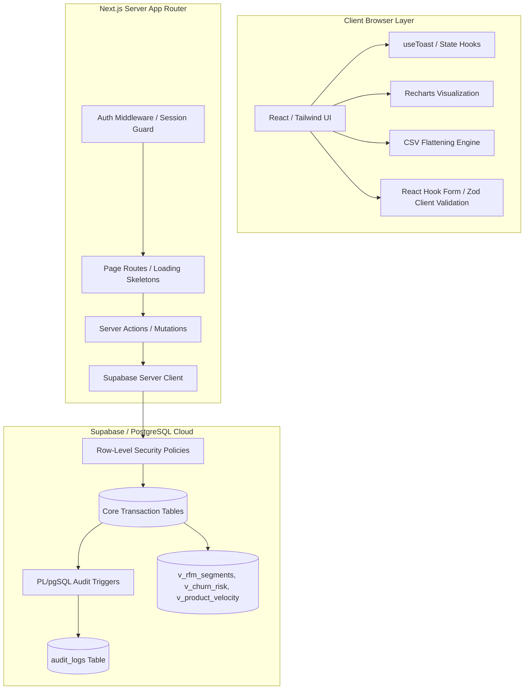

# MetricFlow — B2B Sales Intelligence & Order Management Platform

Bachelor Thesis Project: **"B2B Sales Intelligence and Order Management Web Application Based on Data Analysis"**

MetricFlow is a premium, enterprise-grade B2B Customer Relationship Management (CRM) and Order Management System designed to bridge the gap between transactional databases and predictive business intelligence. Developed with a modern Next.js server-first architecture and integrated directly with Supabase, it provides robust, high-performance sales diagnostics, customer segmentation, database audit logs, and security enforcement.

---

## 📖 Academic & Project Overview
This project is built to satisfy the requirements of a Bachelor's Thesis in Computer Science and Software Engineering. It addresses a common challenge in modern B2B SaaS applications: **how to elevate standard operational databases into diagnostic and predictive intelligence systems without overloading the application tier.**

MetricFlow implements a **database-centric architecture**. Rather than running heavy aggregation, sorting, filtering, and statistical analysis within the Node.js application server or the client browser, it delegates these tasks to PostgreSQL views, indexes, triggers, and window functions. This minimizes memory overhead, reduces API payload sizes, ensures database schema-level data security, and guarantees high-performance responses even under heavy data loads.

---

## 🏗 System Architecture & Data Flow

MetricFlow utilizes a modern multi-tier web application architecture:



### 1. Database Schema Design (Entity-Relationship Model)
The system is built on a highly normalized PostgreSQL schema optimized with specific indexes for frequent search operations:
*   **`user_profiles`**: Extends Supabase's `auth.users` table with application level profile data. Created automatically via a database trigger (`on_auth_user_created`) when users sign up.
*   **`companies`**: Holds B2B clients, segmented by `tier` (`smb`, `mid_market`, `enterprise`), industry, and financial metrics.
*   **`contacts`**: Stores company-associated individuals. Multiple contacts can link to a company, with one flagged as `is_primary` to streamline order inquiries.
*   **`products`**: Maintains inventory items, categorized with SKU enforcement, stock levels, and category groupings.
*   **`orders`**: Captures sales records containing tracking numbers, status (`draft`, `pending`, `confirmed`, `processing`, `shipped`, `delivered`, `cancelled`), expected delivery dates, and monetary calculations.
*   **`order_items`**: Junction table holding quantities, prices, and generated `line_total` values. A database trigger (`sync_order_total`) automatically recalculates the parent order's `total_amount` whenever items are inserted, updated, or deleted.
*   **`audit_logs`**: Verifiable history table logging changes made to CRM and Order records.

---

## 🧠 Core Modules: What They Do & How They Do It

### 1. Sales Intelligence & Predictive Analytics
Instead of running calculations in JavaScript, MetricFlow handles analytics directly inside PostgreSQL using optimized views:

#### A. RFM Customer Segmentation (`v_rfm_segments`)
*   **The Theory**: RFM (Recency, Frequency, Monetary) is a gold standard for B2B e-commerce intelligence. Clients are graded based on:
    *   *Recency (R)*: Elapsed days since their last placed order.
    *   *Frequency (F)*: Total volume of orders placed.
    *   *Monetary (M)*: Total budget spent with the organization.
*   **How it works**: The PostgreSQL view aggregates order histories (excluding drafts/cancelled orders). It leverages the `NTILE(4)` window function to distribute clients into four quartiles for each metric:
    ```sql
    ntile(4) over (order by recency desc) as r_score,   -- 4 is most recent, 1 is oldest
    ntile(4) over (order by frequency asc) as f_score,  -- 4 is most frequent, 1 is least
    ntile(4) over (order by monetary asc) as m_score    -- 4 is highest spend, 1 is lowest
    ```
    The scores are concatenated into an RFM code (e.g. `4-4-4` or `1-2-1`) and mapped to behavioral segments:
    *   *Champions* (R $\ge$ 3, F $\ge$ 3, M $\ge$ 3)
    *   *Loyal Customers* (R $\ge$ 3, F $\ge$ 1, M $\ge$ 3)
    *   *At Risk* (R $\le$ 2, F $\ge$ 2, M $\ge$ 2)
    *   *Lost / Hibernating* (R $\le$ 2, F $\le$ 2)
*   **UI Presentation**: Visualized in Recharts via `RfmSegmentChart` (a responsive horizontal bar chart) and a detailed filterable data matrix (`RfmDetailsTable`) located under the route directory components.

#### B. Automated Churn Risk Detection (`v_churn_risk`)
*   **The Theory**: Customer churn is a lagging indicator. To address it preemptively, MetricFlow monitors each client's purchasing cadence (average days between orders) and flags sudden drops in activity.
*   **How it works**: The view calculates the mathematical average of order intervals per company. If the current days elapsed since their last order exceeds their historical average interval by **1.5x**, the client is flagged (`is_at_risk = true`):
    ```sql
    (oi.days_since_last_order > (coalesce(oi.avg_days_between, 45) * 1.5)) as is_at_risk
    ```
*   **UI Presentation**: Surfaces critical alerts in an executive alert feed on the main Dashboard, enabling sales reps to intervene before the customer churns.

#### C. Product Velocity & Stockout Forecasting (`v_product_velocity`)
*   **The Theory**: Supply chain delays lead to lost revenue. Stockout forecasting models inventory depletion based on current sales velocity.
*   **How it works**: The view calculates the product velocity (units sold per day over the last 30 days) and divides the current stock level by this velocity to forecast days remaining before depletion:
    ```sql
    round(coalesce(s.total_units_sold, 0)::numeric / 30.0, 2) as avg_daily_velocity,
    least(round(p.stock_qty::numeric / (coalesce(s.total_units_sold, 0)::numeric / 30.0), 0), 999) as days_to_stockout
    ```
*   **UI Presentation**: Highlights critical products on the dashboard and product catalog with countdown badges and replenishment warnings.

---

### 2. Access Control, RLS & Middleware Routing

#### A. Row-Level Security (RLS) Policies
Data security is enforced directly at the database layer. Even if an attacker compromises the API client keys, they cannot retrieve unauthorized rows because Supabase applies RLS criteria on every SQL compilation.
*   **Order Isolation**: Sales representatives can only view and manage orders explicitly assigned to them (`assigned_to = auth.uid()`). System administrators override this restriction to manage all orders.
*   **Role Promotion Guard**: User roles (`admin`, `sales_rep`, `viewer`) are stored in `user_profiles`. The application updates roles via a secure RPC PostgreSQL function (`update_user_role`). The function is designated as `SECURITY DEFINER` (allowing it to run with elevated privileges to modify profiles) but includes context validation to check that the calling user holds an admin role:
    ```plpgsql
    if not exists (
      select 1 from public.user_profiles
      where id = auth.uid() and role = 'admin'
    ) then
      raise exception 'Access Denied: Only admins can manage roles';
    end if;
    ```

#### B. Edge Middleware & Auth Session Refresh Loop
MetricFlow uses Next.js Middleware (`src/middleware.ts` calling `src/lib/supabase/middleware.ts`) to manage authentication sessions at the network edge:
1.  **Cookie Interception**: The middleware intercepts every request (excluding static assets, images, and favicons) and initializes an isolated `@supabase/ssr` server client using request cookies.
2.  **Session Refresh**: It executes `supabase.auth.getUser()`. If the user's access token (JWT) is expired but a valid refresh token exists, Supabase automatically generates new session cookies. The middleware writes these back into both the request headers (so downstream Server Components receive the refreshed credentials) and the response cookies (updating the user's browser).
3.  **Route Guarding**:
    - **Protected Routes**: If no active user session is found and the path belongs to the app dashboard, the request is redirected to `/login`, appending the original path as a query parameter (`redirectTo`) to enable redirect-back behavior.
    - **Guest Routes**: If a logged-in user attempts to navigate to public guest portals (`/login`, `/register`), the middleware intercepts the transaction and redirects them to `/dashboard`.

---

### 3. Database-Level Transaction Auditing
For regulatory compliance, MetricFlow implements an automated audit trail for core entities.
*   **How it works**: An after-trigger on `companies` and `orders` calls the `process_audit_log` function. It captures the action (`INSERT`, `UPDATE`, `DELETE`), serializes the old row states and new row states into `jsonb` fields, associates the action with the executing user's UUID (`auth.uid()`), and logs them to the `audit_logs` table.
*   **UI Presentation**: Admins can inspect this audit trail in the Settings panel through a timeline component detailing record updates, creation times, and change diffs.

---

### 4. Advanced UX & Performance Systems

#### A. Zero-Fill Chronological Chart Aggregation
Standard databases only record transactions when orders occur. This creates a data visualization issue: a company with sales on Monday and Friday, but none in between, will render a chart that skips Tuesday, Wednesday, and Thursday entirely, causing a misleading slope.
*   **The Solution**: MetricFlow implements a zero-fill alignment algorithm in `src/lib/analytics.ts`.
*   **How it works**: 
    1. The function determines the bounds of the selected range (7 days, 30 days, or 12 months).
    2. It pre-populates a local JS object with every chronological key in that range (e.g. daily dates or monthly descriptors) initialized with `0` values.
    3. It then iterates over the fetched order history, aggregating totals into their corresponding keys.
    4. Finally, it sorts the keys chronologically, outputting a complete, gap-free array (e.g., a solid 30-day timeline) to feed the Recharts component.

#### B. Strict Form Validation & Preemptive Stock Checks
Forms in MetricFlow use React Hook Form combined with Zod schema verification (`src/lib/validations/schemas.ts`) to prevent bad data from reaching Server Actions:
*   **Dynamic Casts**: Handles conversions (such as turning string inputs into numbers via Zod's `z.coerce.number()` or processing empty inputs to SQL-friendly `null` values via preprocessing).
*   **Preemptive Stock Check Alerting**: Inside `OrderForm.tsx`, product dropdown selectors display the available inventory count. If an item has zero stock, its selection is disabled in the client UI. If a user sets an order quantity greater than the warehouse stock count, the form renders a real-time warning label (`Max X left!`).
*   **Checkout Stock Block**: On submission, the client-side code iterates over the proposed items list. If any quantity exceeds database-reported stock availability:
    - Submission is halted immediately.
    - A descriptive warning banner is injected at the bottom of the form.
    - A Radix UI Toast warning notification is launched.
    - The Server Action is blocked, preventing unnecessary roundtrips to the database and preserving API resources.

#### C. Relational Data Flattening (CSV Export Engine)
Exporting JSON arrays directly to spreadsheets leads to unreadable cells when records contain nested relationships (such as a company object nested inside an order record).
*   **How it works**: The custom client-side `ExportButton` component implements a key extraction filter:
    1. It strips standard database IDs (`id`, `company_id`, `assigned_to`) from the header list.
    2. It loops through the dataset and dynamically parses each field.
    3. If it encounters a nested object, it checks for descriptive labels (e.g. `.name` or `.full_name`). It flattens this information into a simple string (extracting the company name or representative's name) rather than writing `[object Object]` into the cell.
    4. The data is converted into a standard comma-separated text string, packaged into a Blob, and downloaded directly via a temporary browser anchor link.

#### D. SSR Hydration & Cookie Security
Next.js Server Components inside MetricFlow render pages directly on the server before transferring HTML to the browser.
*   **How it works**: Server-side page files instantiate the Supabase Server Client using headers and cookies. By using cookies as the storage mechanism for session JWTs, the application does not need to expose Supabase endpoint URLs or authentication tokens to the client-side JavaScript bundle, making the site highly secure against Cross-Site Scripting (XSS) token harvesting.

#### E. Component Co-location and Route Isolation
To enforce route isolation and make the codebase highly maintainable:
*   **Route-Specific Components**: Components that are only consumed by a single route folder are co-located in a `./components/` subdirectory directly inside that route. For example, `src/app/(dashboard)/analytics/components/` hosts view-specific RFM segmentation tables and graphs, and `src/app/(dashboard)/dashboard/components/` hosts top customer metrics.
*   **Shared Primitives**: Only components that are consumed by multiple different routes (e.g., `RevenueChart.tsx` inside charts, or `Pagination.tsx` and `ExportButton.tsx` inside shared) are kept in the global components folder.

---

## 📂 Project Structure

```text
src/
├── actions/             # Secure Next.js Server Actions (mutations & RPC executions)
├── app/
│   ├── (auth)/          # Authentication pages (Login, Register)
│   ├── (dashboard)/     # Protected app pages
│   │   ├── analytics/   # Analytics module (segment charts & RFM detail subcomponents)
│   │   ├── dashboard/   # Dashboard module (top client & order status subcomponents)
│   │   ├── loading.tsx  # Route-specific suspense skeleton screens
│   │   └── error.tsx    # React error boundaries
│   └── auth/callback/   # Supabase OAuth callback route handler
├── components/
│   ├── charts/          # Shared multi-route chart components (RevenueChart)
│   ├── layout/          # Sidebar navigation, User profile dropdowns
│   ├── shared/          # Reusable inputs, Pagination, ExportButton, TableFilters
│   └── ui/              # Base UI primitives (buttons, inputs, cards, toast, etc.)
├── hooks/               # Custom React hooks (use-toast, client state)
├── lib/
│   ├── supabase/        # Supabase client/server connection declarations & middleware
│   ├── validations/     # Zod schemas for forms
│   ├── utils.ts         # Formatting & styling helper functions (Tailwind cn, formatCurrency)
│   └── analytics.ts     # Business logic analytical grouping & zero-fill timeline helpers
└── types/               # Type systems declarations
    ├── supabase.ts      # Auto-generated Typescript types directly from Supabase CLI
    └── database.ts      # Derived type interfaces exported across components
supabase/
├── migrations/          # Incremental database migrations (schema, audit logs, analytics views)
└── seed/                # Python scripts to seed the database with synthetic B2B data
```

---

## ⚙️ Setup & Installation

### 1. Clone the repository and install dependencies
```bash
npm install
```

### 2. Configure Environment Variables
Create a `.env.local` file in the root directory and add your Supabase project keys:
```env
NEXT_PUBLIC_SUPABASE_URL=https://your-project-id.supabase.co
NEXT_PUBLIC_SUPABASE_ANON_KEY=your-anon-key
```

### 3. Deploy Database Migrations
Deploy the migrations sequentially in your Supabase SQL Editor or through the Supabase CLI:
1.  **Schema Base**: [supabase/migrations/001_initial_schema.sql](file:///Users/alinprigoreanu/Documents/Bachelor's%20Thesis/MetricFlow/supabase/migrations/001_initial_schema.sql)
2.  **Audit Logs & RBAC**: [supabase/migrations/002_audit_logs_and_roles.sql](file:///Users/alinprigoreanu/Documents/Bachelor's%20Thesis/MetricFlow/supabase/migrations/002_audit_logs_and_roles.sql)
3.  **Sales Intelligence Views**: [supabase/migrations/003_sales_intelligence.sql](file:///Users/alinprigoreanu/Documents/Bachelor's%20Thesis/MetricFlow/supabase/migrations/003_sales_intelligence.sql)

### 4. Regenerate Database TypeScript Definitions
To update TypeScript types whenever schema changes are deployed:
```bash
npx supabase gen types typescript --project-id your-project-id > src/types/supabase.ts
```

### 5. Seed Seed-Data
To generate high-quality B2B dataset for demonstration:
```bash
cd supabase/seed
pip install faker
python seed_data.py > seed.sql
```
*Note: Open `seed.sql`, replace `ADMIN_USER_ID` references with your authenticated User ID, and run the SQL script in your Supabase editor.*

### 6. Launch Development Server
```bash
npm run dev
```
Open [http://localhost:3000](http://localhost:3000) to view the application.

---

## 🚢 Deployment

Ensure environment variables are configured on the deployment provider (e.g., Vercel):
```bash
vercel --prod
```
All route handlers compile statically or dynamically depending on dynamic params.
