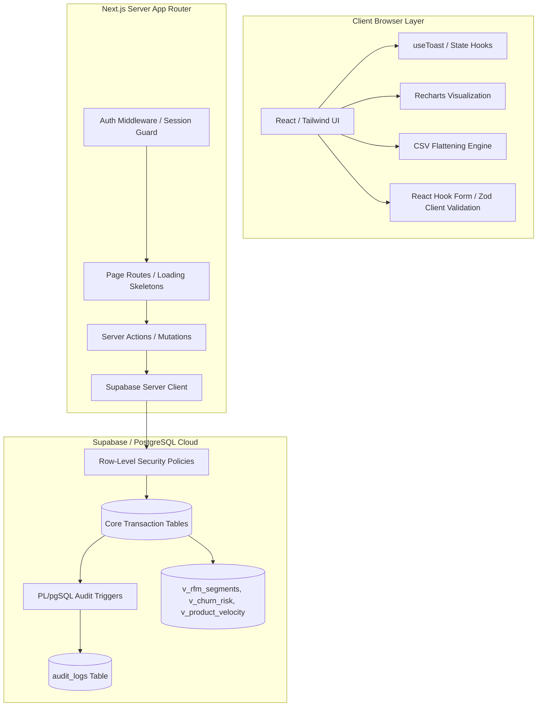

# MetricFlow — B2B Sales Intelligence & Order Management Platform

Bachelor Thesis Project: **"B2B Sales Intelligence and Order Management Web Application Based on Data Analysis"**

MetricFlow is a premium, enterprise-grade B2B Customer Relationship Management (CRM) and Order Management System designed to bridge the gap between transactional databases and predictive business intelligence. Developed with a modern Next.js server-first architecture and integrated directly with Supabase, it provides robust, high-performance sales diagnostics, customer segmentation, database audit logs, and security enforcement.

---

## 📖 Academic & Project Overview
This project is built to satisfy the requirements of a Bachelor's Thesis in Computer Science and Software Engineering. It addresses a common challenge in modern B2B SaaS applications: **how to elevate standard operational databases into diagnostic and predictive intelligence systems without overloading the application tier.**

MetricFlow implements a **database-centric architecture**. Rather than running heavy aggregation, sorting, filtering, and statistical analysis within the Node.js application server or the client browser, it delegates these tasks to PostgreSQL views, indexes, triggers, and window functions. This minimizes memory overhead, reduces API payload sizes, ensures database schema-level data security, and guarantees high-performance responses even under heavy data loads.

---

## 🎓 Beginner Developer's Learning Guide

This codebase has been intentionally designed and extensively commented to serve as a comprehensive learning resource for beginner developers. Throughout the project, you will find detailed educational comments explaining not just **what** the code does, but **why** specific patterns, architectures, and performance choices were made.

If you are new to programming, React, Next.js, or cloud databases, here is a guide mapping key engineering concepts to files where you can see them implemented:

### Key Concepts & Learning Paths

#### 1. React Server Components (RSC) vs. Client Components
*   **Concept**: RSCs run entirely on the server to retrieve database records directly and render fast HTML, lowering the amount of JavaScript sent to client browsers. Client Components (marked with `"use client"` at the top) run in the browser and handle local states, mouse clicks, and typing input.
*   **Where to study**:
    *   [companies/page.tsx](file:///Users/alinprigoreanu/Documents/Bachelor's%20Thesis/MetricFlow/src/app/(dashboard)/companies/page.tsx) & [dashboard/page.tsx](file:///Users/alinprigoreanu/Documents/Bachelor's%20Thesis/MetricFlow/src/app/(dashboard)/dashboard/page.tsx): Study how Server Components fetch data using Supabase clients.
    *   [CompanyForm.tsx](file:///Users/alinprigoreanu/Documents/Bachelor's%20Thesis/MetricFlow/src/app/(dashboard)/companies/components/CompanyForm.tsx): See how form fields, button loaders, and dynamic validation messages run in a browser-first Client Component.

#### 2. Next.js App Router Pages & Search Parameters Routing
*   **Concept**: Routing determines what URL paths load what code. We use query parameters (like `?q=search&page=2`) to share state between pages, allowing users to bookmark exact page configurations.
*   **Where to study**:
    *   [companies/page.tsx](file:///Users/alinprigoreanu/Documents/Bachelor's%20Thesis/MetricFlow/src/app/(dashboard)/companies/page.tsx): Explains Next.js `searchParams` parsing, base-10 parsing safety, and dynamic offset calculations (`(page - 1) * limit`).
    *   [TableFilters.tsx](file:///Users/alinprigoreanu/Documents/Bachelor's%20Thesis/MetricFlow/src/components/shared/TableFilters.tsx): Learn how client forms update parameters, debouncing input value changes to prevent database overload.

#### 3. Advanced Relational Joins & Sub-queries in Supabase (PostgREST)
*   **Concept**: PostgreSQL relationships connect models together. Since cloud databases are accessed via stateless API requests, we query parent records and their children in single, high-performance requests.
*   **Where to study**:
    *   [orders/[id]/page.tsx](file:///Users/alinprigoreanu/Documents/Bachelor's%20Thesis/MetricFlow/src/app/(dashboard)/orders/%5Bid%5D/page.tsx): Look at the sub-join selector `order_items(*, product:products(...))` mapping multiple levels of relations (Orders $\to$ Order Items $\to$ Products).
    *   [orders/page.tsx](file:///Users/alinprigoreanu/Documents/Bachelor's%20Thesis/MetricFlow/src/app/(dashboard)/orders/page.tsx): Study how cross-table searches are resolved by first catching IDs in sub-queries, then joining them via OR conditions.

#### 4. TypeScript Typings, Generics, and Mapped Types
*   **Concept**: TypeScript guarantees type safety, catching bugs during development before they break in production. We can write generic utilities that dynamically modify data structures.
*   **Where to study**:
    *   [types/index.ts](file:///Users/alinprigoreanu/Documents/Bachelor's%20Thesis/MetricFlow/src/types/index.ts): Study generics, database schema derivation types, and mapping structures like `NonNullableFields<T>`.

#### 5. Safe Client Imports (Disabling Server-Side Rendering)
*   **Concept**: Libraries that query browser globals (`window` or `document`) will crash when pre-rendered on the server since Node.js has no DOM. We lazy-load these libraries only on the browser.
*   **Where to study**:
    *   [analytics/page.tsx](file:///Users/alinprigoreanu/Documents/Bachelor's%20Thesis/MetricFlow/src/app/(dashboard)/analytics/page.tsx): Look at the `next/dynamic` imports with `{ ssr: false }` and skeletal layout animations.

#### 6. Browser Memory Safety & Blob URLs
*   **Concept**: Converting client memory objects into physical download attachments safely without causing memory leaks.
*   **Where to study**:
    *   [ExportButton.tsx](file:///Users/alinprigoreanu/Documents/Bachelor's%20Thesis/MetricFlow/src/components/shared/ExportButton.tsx): Learn about JSON serialization, MIME types, `URL.createObjectURL()`, and garbage collection revocation.

---

## 🏗 System Architecture & Data Flow

MetricFlow utilizes a modern multi-tier web application architecture:



### 1. Database Schema & Data Dictionary (Relational Model)

MetricFlow's core engine relies on a normalized PostgreSQL schema designed to guarantee referential integrity and optimized with specific indexes for query performance. Below is the complete data dictionary detailing each table's structure, constraints, and relational mappings:

#### A. Table: `user_profiles`
Extends Supabase's built-in `auth.users` table to maintain CRM-level user metadata and role permissions.

| Column | Data Type | Constraints / Flags | Description |
| :--- | :--- | :--- | :--- |
| `id` | `uuid` | Primary Key, `REFERENCES auth.users(id) ON DELETE CASCADE` | Connects system accounts to Supabase Auth profiles. |
| `email` | `text` | NOT NULL | User's email address cached for quick profile queries. |
| `full_name` | `text` | NOT NULL, DEFAULT `''` | User's full display name. |
| `role` | `user_role` (enum) | NOT NULL, DEFAULT `'sales_rep'` | Roles: `'admin'`, `'sales_rep'`, `'viewer'`. |
| `avatar_url` | `text` | Nullable | S3 bucket or external link to user image. |
| `created_at` | `timestamptz`| NOT NULL, DEFAULT `now()` | Record creation timestamp. |
| `updated_at` | `timestamptz`| NOT NULL, DEFAULT `now()` | Record modification timestamp. |

*   **Associated Automation**: Trigger `on_auth_user_created` calls `handle_new_user()` on inserts to the core authentication tables.

#### B. Table: `companies`
Tracks client companies registered within the B2B CRM.

| Column | Data Type | Constraints / Flags | Description |
| :--- | :--- | :--- | :--- |
| `id` | `uuid` | Primary Key, DEFAULT `uuid_generate_v4()` | Unique company identifier. |
| `name` | `text` | NOT NULL | Name of the B2B organization. |
| `industry` | `text` | NOT NULL | Business industry segment. |
| `country` | `text` | NOT NULL, DEFAULT `'Romania'` | Regional country location. |
| `city` | `text` | Nullable | Regional city location. |
| `tier` | `company_tier` (enum)| NOT NULL, DEFAULT `'smb'` | Tier classifications: `'smb'`, `'mid_market'`, `'enterprise'`. |
| `annual_revenue`| `numeric(15,2)` | Nullable, CHECK `annual_revenue >= 0` | Client's reported financial status. |
| `employee_count`| `integer` | Nullable, CHECK `employee_count >= 0` | Total personnel headcount. |
| `website` | `text` | Nullable | Website address. |
| `notes` | `text` | Nullable | Additional descriptive details. |
| `created_by` | `uuid` | `REFERENCES user_profiles(id)` | Sales representative managing the relationship. |
| `created_at` | `timestamptz`| NOT NULL, DEFAULT `now()` | Date added to CRM. |
| `updated_at` | `timestamptz`| NOT NULL, DEFAULT `now()` | Last updated date. |

*   **Indexes**: 
    - `idx_companies_tier` on `tier` (B-Tree index for quick filters)
    - `idx_companies_country` on `country` (B-Tree index for regional metrics)
*   **Associated Automation**: Triggers audit mutations (`audit_companies_trigger`) and updates timestamps.

#### C. Table: `contacts`
Tracks individual decision-makers or contacts associated with B2B companies.

| Column | Data Type | Constraints / Flags | Description |
| :--- | :--- | :--- | :--- |
| `id` | `uuid` | Primary Key, DEFAULT `uuid_generate_v4()` | Unique contact identifier. |
| `company_id` | `uuid` | NOT NULL, `REFERENCES companies(id) ON DELETE CASCADE` | Parent company association. |
| `full_name` | `text` | NOT NULL | Full name of the contact. |
| `email` | `text` | NOT NULL | Email address. |
| `phone` | `text` | Nullable | Contact number. |
| `job_title` | `text` | Nullable | Position within their company. |
| `is_primary` | `boolean` | NOT NULL, DEFAULT `false` | Flag indicating the primary contact for client orders. |
| `created_at` | `timestamptz`| NOT NULL, DEFAULT `now()` | Date created. |
| `updated_at` | `timestamptz`| NOT NULL, DEFAULT `now()` | Date modified. |

*   **Indexes**: `idx_contacts_company` on `company_id` (Speeds up loading contacts in Company Detail screens)

#### D. Table: `products`
Maintains records of hardware, software, or services offered for order placement.

| Column | Data Type | Constraints / Flags | Description |
| :--- | :--- | :--- | :--- |
| `id` | `uuid` | Primary Key, DEFAULT `uuid_generate_v4()` | Unique product identifier. |
| `name` | `text` | NOT NULL | Product model name. |
| `sku` | `text` | NOT NULL, UNIQUE | Unique stock keeping unit. |
| `category` | `product_category`| NOT NULL | Categories: `'software'`, `'hardware'`, `'services'`, etc. |
| `description` | `text` | Nullable | Core product descriptions. |
| `unit_price` | `numeric(10,2)` | NOT NULL, CHECK `unit_price > 0` | Cost per individual item unit. |
| `stock_qty` | `integer` | NOT NULL, DEFAULT `0`, CHECK `stock_qty >= 0` | Available stock count in warehousing. |
| `is_active` | `boolean` | NOT NULL, DEFAULT `true` | Visibility toggle for orders form catalog. |
| `created_at` | `timestamptz`| NOT NULL, DEFAULT `now()` | Date created. |
| `updated_at` | `timestamptz`| NOT NULL, DEFAULT `now()` | Date modified. |

*   **Indexes**:
    - `idx_products_category` on `category` (For indexing product listings)
    - `idx_products_active` on `is_active` (Excludes inactive items from forms)

#### E. Table: `orders`
Logs general metadata for B2B transactional sales events.

| Column | Data Type | Constraints / Flags | Description |
| :--- | :--- | :--- | :--- |
| `id` | `uuid` | Primary Key, DEFAULT `uuid_generate_v4()` | Unique order identifier. |
| `order_number` | `text` | NOT NULL, UNIQUE, DEFAULT `'ORD-' || (uuid)` | Tracking code for billing invoice references. |
| `company_id` | `uuid` | NOT NULL, `REFERENCES companies(id)` | Purchasing company account. |
| `assigned_to` | `uuid` | NOT NULL, `REFERENCES user_profiles(id)` | Sales rep in charge of managing order completion. |
| `status` | `order_status` | NOT NULL, DEFAULT `'draft'` | Progress: `'draft'`, `'pending'`, `'confirmed'`, etc. |
| `total_amount` | `numeric(15,2)` | NOT NULL, DEFAULT `0` | Recalculated sum of lines (re-syncs via triggers). |
| `order_date` | `date` | NOT NULL, DEFAULT `current_date` | Placed order date. |
| `expected_delivery`| `date` | Nullable | Planned shipping arrival date. |
| `notes` | `text` | Nullable | Delivery guidelines notes. |
| `created_at` | `timestamptz`| NOT NULL, DEFAULT `now()` | Date registered. |
| `updated_at` | `timestamptz`| NOT NULL, DEFAULT `now()` | Date updated. |

*   **Indexes**:
    - `idx_orders_company` on `company_id`
    - `idx_orders_status` on `status`
    - `idx_orders_date` on `order_date desc` (Speeds up listing chronologies)
    - `idx_orders_assigned` on `assigned_to`
*   **Associated Automation**: Trigger `sync_order_total` recalculates values. Audit triggers log mutations.

#### F. Table: `order_items`
Contains individual items purchased in an order, executing calculated stored fields.

| Column | Data Type | Constraints / Flags | Description |
| :--- | :--- | :--- | :--- |
| `id` | `uuid` | Primary Key, DEFAULT `uuid_generate_v4()` | Unique line item identifier. |
| `order_id` | `uuid` | NOT NULL, `REFERENCES orders(id) ON DELETE CASCADE` | Connected parent order. |
| `product_id` | `uuid` | NOT NULL, `REFERENCES products(id)` | Linked product record. |
| `quantity` | `integer` | NOT NULL, CHECK `quantity > 0` | Quantity ordered. |
| `unit_price` | `numeric(10,2)` | NOT NULL, CHECK `unit_price > 0` | Cost of product at purchase date. |
| `line_total` | `numeric(15,2)` | GENERATED ALWAYS AS (`quantity * unit_price`) STORED | Database-calculated line total. |

*   **Indexes**:
    - `idx_order_items_order` on `order_id`
    - `idx_order_items_product` on `product_id`

#### G. Table: `audit_logs`
Verifiable transaction history log for auditing updates.

| Column | Data Type | Constraints / Flags | Description |
| :--- | :--- | :--- | :--- |
| `id` | `uuid` | Primary Key, DEFAULT `uuid_generate_v4()` | Unique log identifier. |
| `table_name` | `text` | NOT NULL | Targeted table name (`companies` / `orders`). |
| `action` | `text` | NOT NULL | Mutation action type: `'INSERT'`, `'UPDATE'`, `'DELETE'`. |
| `record_id` | `uuid` | NOT NULL | Primary key of modified row. |
| `old_data` | `jsonb` | Nullable | Snapshot of values *before* changes occurred. |
| `new_data` | `jsonb` | Nullable | Snapshot of values *after* changes occurred. |
| `changed_by` | `uuid` | `REFERENCES user_profiles(id) ON DELETE SET NULL` | ID of user executing action (`auth.uid()`). |
| `changed_at` | `timestamptz`| NOT NULL, DEFAULT `now()` | Transaction execution timestamp. |

---

### 2. Database Triggers & Stored Procedures (PL/pgSQL Automation)

MetricFlow utilizes PL/pgSQL database trigger functions to automate logic directly inside PostgreSQL, keeping data calculations safe from client-side network interruptions:

#### A. Order Subtotal Recalculation Trigger (`sync_order_total`)
Ensures that the parent order's `total_amount` is always in sync with its child order items. It runs automatically `AFTER INSERT OR UPDATE OR DELETE` on `order_items`:
```sql
create or replace function public.recalculate_order_total()
returns trigger as $$
begin
  update public.orders
  set
    total_amount = (
      select coalesce(sum(line_total), 0)
      from public.order_items
      where order_id = coalesce(new.order_id, old.order_id)
    ),
    updated_at = now()
  where id = coalesce(new.order_id, old.order_id);
  return coalesce(new, old);
end;
$$ language plpgsql;
```

#### B. CRM Audit Logging Trigger (`process_audit_log`)
Monitors the `companies` and `orders` tables, capturing all updates, creations, and deletions, serializing old and new rows into JSON, and attributing the operation to the authenticated user ID (`auth.uid()`):
```sql
create or replace function public.process_audit_log()
returns trigger as $$
declare
  current_user_id uuid;
begin
  current_user_id := auth.uid();

  if (TG_OP = 'DELETE') then
    insert into public.audit_logs (table_name, action, record_id, old_data, changed_by)
    values (TG_TABLE_NAME, TG_OP, old.id, row_to_json(old)::jsonb, current_user_id);
    return old;
  elsif (TG_OP = 'UPDATE') then
    insert into public.audit_logs (table_name, action, record_id, old_data, new_data, changed_by)
    values (TG_TABLE_NAME, TG_OP, new.id, row_to_json(old)::jsonb, row_to_json(new)::jsonb, current_user_id);
    return new;
  elsif (TG_OP = 'INSERT') then
    insert into public.audit_logs (table_name, action, record_id, new_data, changed_by)
    values (TG_TABLE_NAME, TG_OP, new.id, row_to_json(new)::jsonb, current_user_id);
    return new;
  end if;
  return null;
end;
$$ language plpgsql security definer;
```

---

## 🧠 Core Modules: What They Do & How They Do It

### 1. Sales Intelligence & Predictive Analytics
Instead of running calculations in JavaScript, MetricFlow handles analytics directly inside PostgreSQL using optimized views:

#### A. RFM Customer Segmentation (`v_rfm_segments`)
*   **The Theory**: RFM (Recency, Frequency, Monetary) is a gold standard for B2B e-commerce intelligence. Clients are graded based on:
    *   *Recency (R)*: Elapsed days since their last placed order.
    *   *Frequency (F)*: Total volume of orders placed.
    *   *Monetary (M)*: Total budget spent with the organization.
*   **How it works**: The PostgreSQL view aggregates order histories (excluding drafts/cancelled orders). It leverages the `NTILE(4)` window function to distribute clients into four quartiles for each metric:
    ```sql
    create or replace view public.v_rfm_segments as
    with raw_metrics as (
      select
        c.id as company_id,
        c.name as company_name,
        c.tier,
        (current_date - max(o.order_date))::integer as recency,
        count(o.id)::integer as frequency,
        coalesce(sum(o.total_amount), 0) as monetary
      from public.companies c
      join public.orders o on o.company_id = c.id
      where o.status not in ('draft', 'cancelled')
      group by c.id, c.name, c.tier
    ),
    scores as (
      select
        *,
        ntile(4) over (order by recency desc) as r_score, -- Older last dates get 1, more recent gets 4
        ntile(4) over (order by frequency asc) as f_score, -- Fewer orders gets 1, more orders gets 4
        ntile(4) over (order by monetary asc) as m_score   -- Smaller spend gets 1, larger spend gets 4
      from raw_metrics
    )
    select
      *,
      (r_score || '-' || f_score || '-' || m_score) as rfm_code,
      case
        when r_score >= 3 and f_score >= 3 and m_score >= 3 then 'Champions'
        when r_score >= 3 and f_score >= 1 and m_score >= 3 then 'Loyal Customers'
        when r_score >= 3 and f_score >= 3 and m_score >= 1 then 'Promising'
        when r_score >= 3 and f_score >= 1 and m_score >= 1 then 'New Customers'
        when r_score <= 2 and f_score >= 3 and m_score >= 3 then 'Can''t Lose Them'
        when r_score <= 2 and f_score >= 2 and m_score >= 2 then 'At Risk'
        when r_score <= 2 and f_score <= 2 and m_score >= 2 then 'About to Sleep'
        else 'Lost / Hibernating'
      end as rfm_segment
    from scores;
    ```
*   **UI Presentation**: Visualized in Recharts via `RfmSegmentChart` (a responsive horizontal bar chart) and a detailed filterable data matrix (`RfmDetailsTable`) located under the route directory components.

#### B. Automated Churn Risk Detection (`v_churn_risk`)
*   **The Theory**: Customer churn is a lagging indicator. To address it preemptively, MetricFlow monitors each client's purchasing cadence (average days between orders) and flags sudden drops in activity.
*   **How it works**: The view calculates the mathematical average of order intervals per company. If the current days elapsed since their last order exceeds their historical average interval by **1.5x**, the client is flagged (`is_at_risk = true`):
    ```sql
    create or replace view public.v_churn_risk as
    with order_intervals as (
      select
        company_id,
        (current_date - max(order_date))::integer as days_since_last_order,
        case
          when count(id) > 1 then
            (max(order_date) - min(order_date))::integer / (count(id) - 1)
          else
            null
        end as avg_days_between
      from public.orders
      where status not in ('draft', 'cancelled')
      group by company_id
    )
    select
      c.id as company_id,
      c.name as company_name,
      c.tier,
      oi.days_since_last_order,
      coalesce(oi.avg_days_between, 45) as avg_days_between,
      (oi.days_since_last_order > (coalesce(oi.avg_days_between, 45) * 1.5)) as is_at_risk,
      round(oi.days_since_last_order::numeric / coalesce(oi.avg_days_between, 45)::numeric, 2) as risk_factor
    from public.companies c
    join order_intervals oi on oi.company_id = c.id;
    ```
*   **UI Presentation**: Surfaces critical alerts in an executive alert feed on the main Dashboard, enabling sales reps to intervene before the customer churns.

#### C. Product Velocity & Stockout Forecasting (`v_product_velocity`)
*   **The Theory**: Supply chain delays lead to lost revenue. Stockout forecasting models inventory depletion based on current sales velocity.
*   **How it works**: The view calculates the product velocity (units sold per day over the last 30 days) and divides the current stock level by this velocity to forecast days remaining before depletion:
    ```sql
    create or replace view public.v_product_velocity as
    with sales_last_30_days as (
      select
        product_id,
        coalesce(sum(quantity), 0) as total_units_sold
      from public.order_items oi
      join public.orders o on o.id = oi.order_id
      where o.status not in ('draft', 'cancelled')
        and o.order_date >= (current_date - interval '30 days')
      group by product_id
    )
    select
      p.id as product_id,
      p.name as product_name,
      p.sku,
      p.category,
      p.stock_qty,
      coalesce(s.total_units_sold, 0)::integer as units_sold_30d,
      round(coalesce(s.total_units_sold, 0)::numeric / 30.0, 2) as avg_daily_velocity,
      case
        when coalesce(s.total_units_sold, 0) > 0 then
          least(round(p.stock_qty::numeric / (coalesce(s.total_units_sold, 0)::numeric / 30.0), 0), 999)
        else
          999
      end as days_to_stockout
    from public.products p
    left join sales_last_30_days s on s.product_id = p.id
    where p.is_active = true;
    ```
*   **UI Presentation**: Highlights critical products on the dashboard and product catalog with countdown badges and replenishment warnings.

---

### 2. Access Control, RLS & Middleware Routing

#### A. Row-Level Security (RLS) Policies
Data security is enforced directly at the database layer. Even if an attacker compromises the API client keys, they cannot retrieve unauthorized rows because Supabase applies RLS criteria on every SQL compilation.
*   **Order Isolation**: Sales representatives can only view and manage orders explicitly assigned to them (`assigned_to = auth.uid()`). System administrators override this restriction to manage all orders.
*   **Role Promotion Guard**: User roles (`admin`, `sales_rep`, `viewer`) are stored in `user_profiles`. The application updates roles via a secure RPC PostgreSQL function (`update_user_role`). The function is designated as `SECURITY DEFINER` (allowing it to run with elevated privileges to modify profiles) but includes context validation to check that the calling user holds an admin role:
    ```plpgsql
    if not exists (
      select 1 from public.user_profiles
      where id = auth.uid() and role = 'admin'
    ) then
      raise exception 'Access Denied: Only admins can manage roles';
    end if;
    ```

#### B. Edge Middleware & Auth Session Refresh Loop
MetricFlow uses Next.js Middleware (`src/middleware.ts` calling `src/lib/supabase/middleware.ts`) to manage authentication sessions at the network edge:
1.  **Cookie Interception**: The middleware intercepts every request (excluding static assets, images, and favicons) and initializes an isolated `@supabase/ssr` server client using request cookies.
2.  **Session Refresh**: It executes `supabase.auth.getUser()`. If the user's access token (JWT) is expired but a valid refresh token exists, Supabase automatically generates new session cookies. The middleware writes these back into both the request headers (so downstream Server Components receive the refreshed credentials) and the response cookies (updating the user's browser).
3.  **Route Guarding**:
    - **Protected Routes**: If no active user session is found and the path belongs to the app dashboard, the request is redirected to `/login`, appending the original path as a query parameter (`redirectTo`) to enable redirect-back behavior.
    - **Guest Routes**: If a logged-in user attempts to navigate to public guest portals (`/login`, `/register`), the middleware intercepts the transaction and redirects them to `/dashboard`.

---

### 3. Database-Level Transaction Auditing
For regulatory compliance, MetricFlow implements an automated audit trail for core entities.
*   **How it works**: An after-trigger on `companies` and `orders` calls the `process_audit_log` function. It captures the action (`INSERT`, `UPDATE`, `DELETE`), serializes the old row states and new row states into `jsonb` fields, associates the action with the executing user's UUID (`auth.uid()`), and logs them to the `audit_logs` table.
*   **UI Presentation**: Admins can inspect this audit trail in the Settings panel through a timeline component detailing record updates, creation times, and change diffs.

---

### 4. Advanced UX & Performance Systems

#### A. Zero-Fill Chronological Chart Aggregation
Standard databases only record transactions when orders occur. This creates a data visualization issue: a company with sales on Monday and Friday, but none in between, will render a chart that skips Tuesday, Wednesday, and Thursday entirely, causing a misleading slope.
*   **The Solution**: MetricFlow implements a zero-fill alignment algorithm in `src/lib/analytics.ts`.
*   **How it works**: 
    1. The function determines the bounds of the selected range (7 days, 30 days, or 12 months).
    2. It pre-populates a local JS object with every chronological key in that range (e.g. daily dates or monthly descriptors) initialized with `0` values.
    3. It then iterates over the fetched order history, aggregating totals into their corresponding keys.
    4. Finally, it sorts the keys chronologically, outputting a complete, gap-free array (e.g., a solid 30-day timeline) to feed the Recharts component.

#### B. Strict Form Validation & Preemptive Stock Checks
Forms in MetricFlow use React Hook Form combined with Zod schema verification (`src/lib/validations/schemas.ts`) to prevent bad data from reaching Server Actions:
*   **Dynamic Casts**: Handles conversions (such as turning string inputs into numbers via Zod's `z.coerce.number()` or processing empty inputs to SQL-friendly `null` values via preprocessing).
*   **Preemptive Stock Check Alerting**: Inside `OrderForm.tsx`, product dropdown selectors display the available inventory count. If an item has zero stock, its selection is disabled in the client UI. If a user sets an order quantity greater than the warehouse stock count, the form renders a real-time warning label (`Max X left!`).
*   **Checkout Stock Block**: On submission, the client-side code iterates over the proposed items list. If any quantity exceeds database-reported stock availability:
    - Submission is halted immediately.
    - A descriptive warning banner is injected at the bottom of the form.
    - A Radix UI Toast warning notification is launched.
    - The Server Action is blocked, preventing unnecessary roundtrips to the database and preserving API resources.

#### C. Relational Data Flattening (CSV Export Engine)
Exporting JSON arrays directly to spreadsheets leads to unreadable cells when records contain nested relationships (such as a company object nested inside an order record).
*   **How it works**: The custom client-side `ExportButton` component implements a key extraction filter:
    1. It strips standard database IDs (`id`, `company_id`, `assigned_to`) from the header list.
    2. It loops through the dataset and dynamically parses each field.
    3. If it encounters a nested object, it checks for descriptive labels (e.g. `.name` or `.full_name`). It flattens this information into a simple string (extracting the company name or representative's name) rather than writing `[object Object]` into the cell.
    4. The data is converted into a standard comma-separated text string, packaged into a Blob, and downloaded directly via a temporary browser anchor link.

#### D. SSR Hydration & Cookie Security
Next.js Server Components inside MetricFlow render pages directly on the server before transferring HTML to the browser.
*   **How it works**: Server-side page files instantiate the Supabase Server Client using headers and cookies. By using cookies as the storage mechanism for session JWTs, the application does not need to expose Supabase endpoint URLs or authentication tokens to the client-side JavaScript bundle, making the site highly secure against Cross-Site Scripting (XSS) token harvesting.

#### E. Component Co-location and Route Isolation
To enforce route isolation and make the codebase highly maintainable:
*   **Route-Specific Components**: Components that are only consumed by a single route folder are co-located in a `./components/` subdirectory directly inside that route. For example, `src/app/(dashboard)/analytics/components/` hosts view-specific RFM segmentation tables and graphs, and `src/app/(dashboard)/dashboard/components/` hosts top customer metrics.
*   **Shared Primitives**: Only components that are consumed by multiple different routes (e.g., `RevenueChart.tsx` inside charts, or `Pagination.tsx` and `ExportButton.tsx` inside shared) are kept in the global components folder.

### 5. Next.js Server & Application Architecture

For academic evaluation, the software layers in the MetricFlow application are structured around Next.js modern paradigms:

#### A. OAuth Session Callbacks & Code Exchanges (`src/app/auth/callback/route.ts`)
When users authenticate, Supabase redirects them back to the Next.js router with a query code (`?code=...`). We process this on the server edge to log in securely:
*   **The Route Handler**: Instantiates a cookies-aware Supabase server client and calls `supabase.auth.exchangeCodeForSession(code)`.
*   **Safety Redirects**: If session validation succeeds, it redirects flows back to `/dashboard` (or the specified target dynamic next parameter) without exposing secrets to client states. If it fails, it issues a redirect to the login form with query flags.

#### B. Unified Server Actions Mutation Layer (`src/actions/index.ts`)
Next.js Server Actions execute securely as RPC endpoints. They run entirely on the server and are declared using the `"use server"` directive at the top of the file:
*   **Form Mutations**: Instead of exposing raw API endpoints, our actions like `createOrder` receive validated form payloads, execute server queries inside transaction wrappers, and output standardized `ActionResult` payloads back to client states.
*   **Type Safety**: Actions are typed with typescript, ensuring complete input validation matching database row structures.
*   **Dynamic Revalidations**: Triggers path revalidation (`revalidatePath`) to clear cached layout states, forcing pages to reload fresh rows without full page refreshes.

#### C. Separation of Supabase Clients (`src/lib/supabase/`)
Next.js Server Components require server-level clients, whereas interactive Client Components require browser clients:
*   **Browser Client (`client.ts`)**: Uses `createBrowserClient` to issue queries using public project keys, utilizing local browser cookie access.
*   **Server Client (`server.ts`)**: Uses `createServerClient` wrapping Next.js request/response cookie headers. This ensures auth tokens (JWTs) are sent with every server-rendered page check, maintaining session integrity.

#### D. Zod Form Schema Validation (`src/lib/validations/`)
All frontend input checks are declared centrally using Zod schema structures in `src/lib/validations/schemas.ts`:
*   **Coerced Casts**: Casts HTML string inputs (like number inputs) into numbers (`z.coerce.number()`) and pre-processes blank entries into SQL-friendly `null` values.
*   **Pre-mutations Validation**: Forms match schemas on submission, blocking network queries if data integrity fails.

#### E. State Management Toaster reducer (`src/hooks/use-toast.ts`)
Renders sliding Radix UI notifications. Features an optimized React state reducer queueing, firing, and automatically garbage-collecting Toast objects after timeouts, ensuring browser performance is preserved.

---

## 📂 Project Structure

```text
src/
├── actions/             # Secure Next.js Server Actions (mutations & RPC executions)
├── app/
│   ├── (auth)/          # Authentication pages (Login, Register)
│   ├── (dashboard)/     # Protected app pages
│   │   ├── analytics/   # Analytics module (segment charts & RFM detail subcomponents)
│   │   ├── companies/   # Company CRM management (lists, details, create/edit forms)
│   │   ├── contacts/    # Contact management (lists, create contact forms)
│   │   ├── dashboard/   # Dashboard module (top client & order status subcomponents)
│   │   ├── orders/      # Sales order management (lists, details, multi-item creation forms)
│   │   ├── products/    # Product catalog management (lists, detail, create/edit forms)
│   │   ├── reports/     # Business reports module
│   │   ├── settings/    # Role management and database transaction audit log viewer
│   │   ├── loading.tsx  # Route-specific suspense skeleton screens
│   │   └── error.tsx    # React error boundaries
│   └── auth/callback/   # Supabase OAuth callback route handler
├── components/
│   ├── charts/          # Shared multi-route chart components (RevenueChart)
│   ├── layout/          # Sidebar navigation, User profile dropdowns
│   ├── shared/          # Reusable inputs, Pagination, ExportButton, TableFilters
│   └── ui/              # Base UI primitives (buttons, inputs, cards, toast, etc.)
├── hooks/               # Custom React hooks (use-toast, client state)
├── lib/
│   ├── supabase/        # Supabase client/server connection declarations & middleware
│   ├── validations/     # Zod schemas for forms
│   ├── utils.ts         # Formatting & styling helper functions (Tailwind cn, formatCurrency)
│   └── analytics.ts     # Business logic analytical grouping & zero-fill timeline helpers
└── types/               # Type systems declarations
    └── index.ts         # Consolidated autogenerated & hand-authored UI/Database types
supabase/
├── migrations/          # Incremental database migrations (schema, audit logs, analytics views)
└── seed/                # Python scripts to seed the database with synthetic B2B data
```

---

## ⚙️ Setup & Installation

### 1. Clone the repository and install dependencies
```bash
npm install
```

### 2. Configure Environment Variables
Create a `.env.local` file in the root directory and add your Supabase project keys:
```env
NEXT_PUBLIC_SUPABASE_URL=https://your-project-id.supabase.co
NEXT_PUBLIC_SUPABASE_ANON_KEY=your-anon-key
```

### 3. Deploy Database Migrations
Deploy the migrations sequentially in your Supabase SQL Editor or through the Supabase CLI:
1.  **Schema Base**: [supabase/migrations/001_initial_schema.sql](file:///Users/alinprigoreanu/Documents/Bachelor's%20Thesis/MetricFlow/supabase/migrations/001_initial_schema.sql)
2.  **Audit Logs & RBAC**: [supabase/migrations/002_audit_logs_and_roles.sql](file:///Users/alinprigoreanu/Documents/Bachelor's%20Thesis/MetricFlow/supabase/migrations/002_audit_logs_and_roles.sql)
3.  **Sales Intelligence Views**: [supabase/migrations/003_sales_intelligence.sql](file:///Users/alinprigoreanu/Documents/Bachelor's%20Thesis/MetricFlow/supabase/migrations/003_sales_intelligence.sql)

### 4. Regenerate Database TypeScript Definitions
To update generated types when schema changes are deployed (make sure to preserve the custom helpers appended at the bottom of the file):
```bash
npx supabase gen types typescript --project-id your-project-id > src/types/supabase.gen.ts
# Merge / copy the new types to src/types/index.ts as needed
```

### 5. Seed Seed-Data
To generate high-quality B2B dataset for demonstration:
```bash
cd supabase/seed
pip install faker
python seed_data.py > seed.sql
```
*Note: Open `seed.sql`, replace `ADMIN_USER_ID` references with your authenticated User ID, and run the SQL script in your Supabase editor.*

### 6. Launch Development Server
```bash
npm run dev
```
Open [http://localhost:3000](http://localhost:3000) to view the application.

---

## 🚢 Deployment

Ensure environment variables are configured on the deployment provider (e.g., Vercel):
```bash
vercel --prod
```
All route handlers compile statically or dynamically depending on dynamic params.
